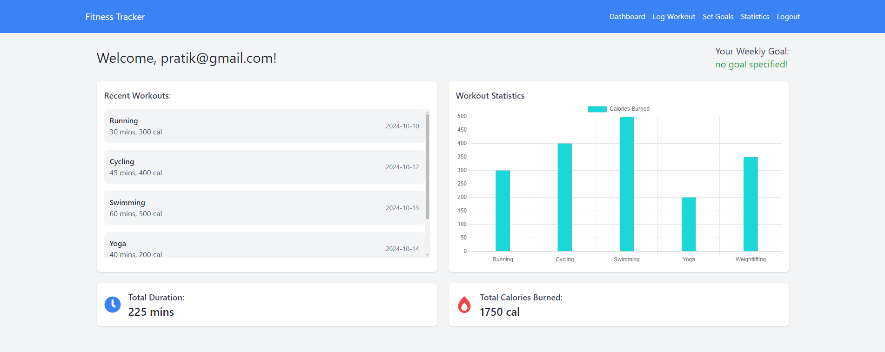
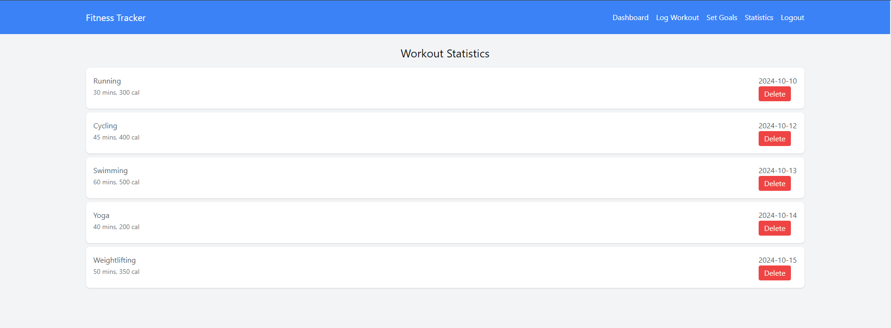

# fitness Tracker - (Create React App)


## Overview
The Fitness Tracker Application is a web-based platform that helps users log their workouts, track fitness progress, set goals, and view detailed statistics. It also includes an admin dashboard for managing user accounts and creating fitness programs. This application is built using React for the frontend and integrates with a backend API for handling user authentication and data management. this website is available on : https://fitness-tracker-three-kohl.vercel.app/




## Features
- User Authentication: Secure login and sign-up functionality.
- Workout Log: Users can log their daily workouts, including activity type, duration, calories burned, and date.
- Fitness Goals: Set weekly or monthly fitness goals and track progress toward achieving them.
- Progress Tracking: View workout statistics through graphical visualizations (e.g., charts of workout frequency, duration, calories burned).

## Tech Stack
- Frontend: React, Context API, Tailwind CSS (for styling)
- State Management: Context API and localStorage for managing app state and user sessions
- Routing: React Router for navigating between pages
- Backend: Integrated with an API for user management, workout logs, and statistics (API not included in this repository)
- Data Visualization: Chart.js or any other library to display workout statistics

## Installation
- Clone the repository:
```
git clone https://github.com/desai-pratik/fitness-tracker.git
```
- Navigate to the project folder:
```
cd fitness-tracker
```
- Install dependencies:
```
npm install
```
- Run the application:
```
npm start
```
- The app will be available at http://localhost:3000/.